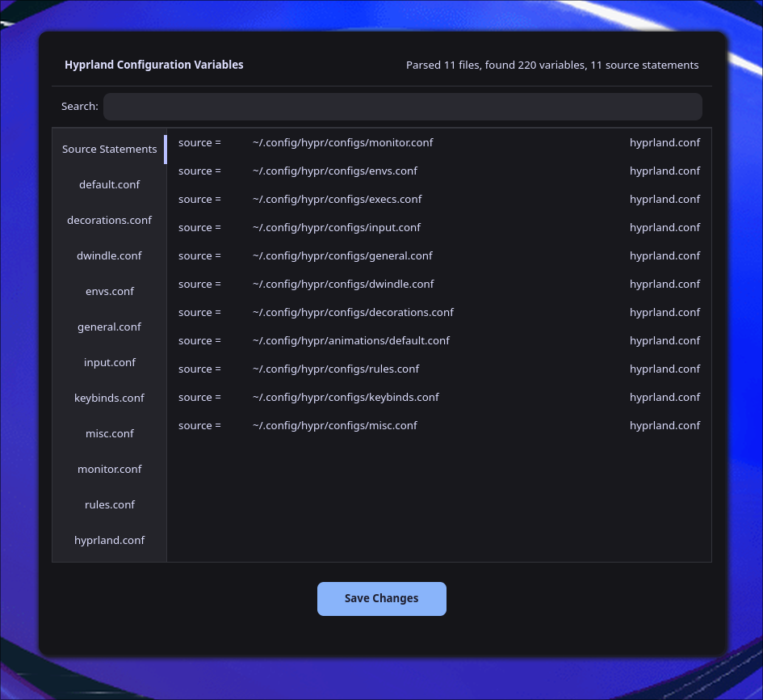
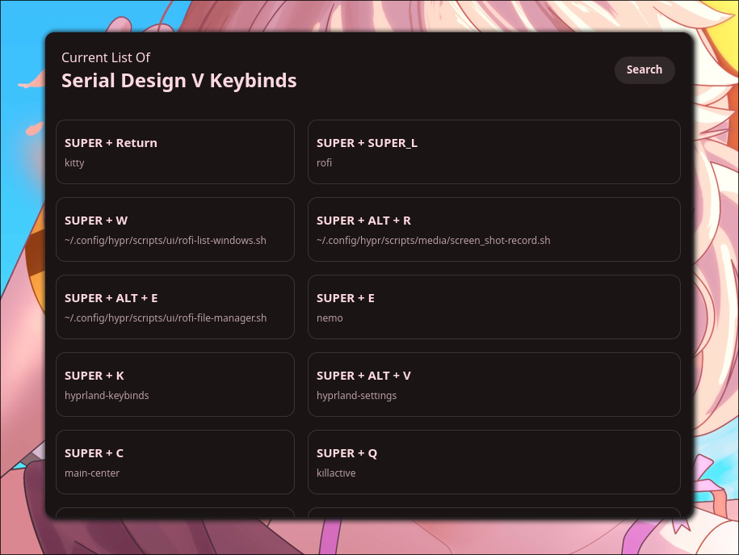
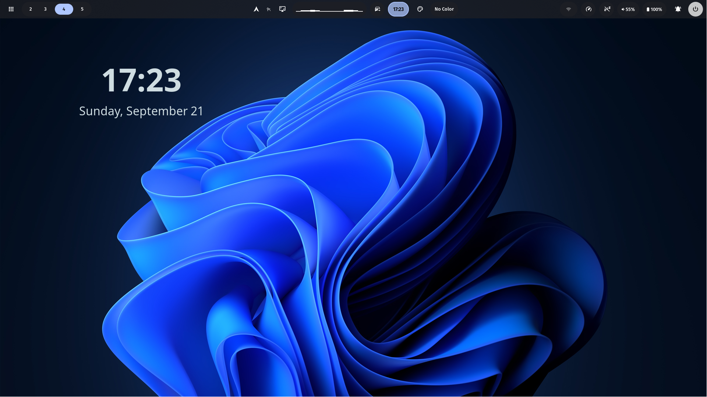
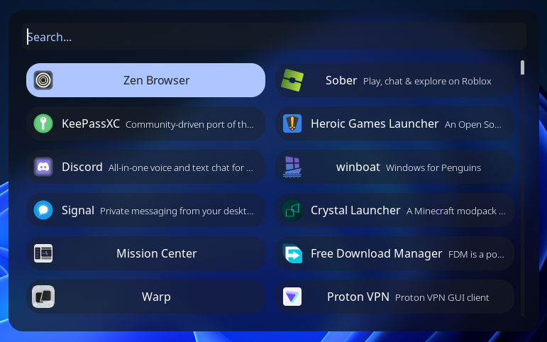
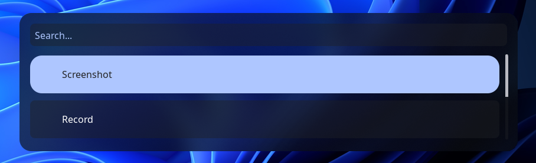

<p align="center">
  
</p>

<h1 align="center">Serial Design V</h1>

<p align="center">
  A modern and elegant Hyprland configuration for Arch Linux
</p>

<p align="center">
  
  
  
  
</p>

## Features

- Automatic setup of Hyprland with dependencies
- One-click installation process
- Complete theming system with GTK integration
- Configuration management with backup and restore options
- Pre-installed file managers (Nemo and Nautilus)
- Settings utility for easy Hyprland configuration
- Custom sound effects for system events
- Keybinds utility for quick reference
- Screenshot utility integration

## Default Theme

Serial Design V comes with a carefully selected default theme setup:

| Component | Theme |
|-----------|-------|
| GTK Theme | Serial Design V Dark |
| Icon Theme | Fluent-grey |
| Cursor Theme | Graphite-dark-cursors |

The theme is designed to provide a cohesive and elegant look across all applications with Material You color themeing.

### Default Wallpaper

<p align="center">
  
</p>

## Subprojects

### Hyprland Settings Utility



The **Hyprland Settings Utility** is a GTK4 application that allows you to view and edit Hyprland settings and configurations directly from a graphical interface.

Built with Rust and GTK4, this utility provides an intuitive way to manage your Hyprland configuration without needing to edit config files manually.

Key features:
- Edit Hyprland variables in real-time
- User-friendly interface for configuration management
- Visual feedback for setting changes
- Organized categories for easier navigation

<br clear="right"/>

### Keybinds Viewer



The **Keybinds Viewer** is a GTK4 application that displays all configured keybindings from your Hyprland configuration.

This utility makes it easy to remember all your custom keyboard shortcuts without having to reference your config files repeatedly.

Key features:
- Clear visualization of all configured keybindings
- Organized by categories for easy reference
- Quick access via keyboard shortcut (Super+Alt+K)
- GTK4 interface that matches the Serial Design V theme

<br clear="right"/>

## Screenshots

| Main Desktop | Applications Menu |
|:------------:|:-----------------:|
|  |  |

<p align="center">
  
</p>

## Sound Files

Serial Design V includes custom sound effects for various system events:

| Sound | Description | File |
|-------|-------------|------|
| Login | Plays when logging in | [login.ogg](res/sounds/login.ogg) |
| Logout | Plays when logging out | [logout.ogg](res/sounds/logout.ogg) |
| Device Added | Plays when a device is connected | [device-added.ogg](res/sounds/device-added.ogg) |
| Device Removed | Plays when a device is disconnected | [device-removed.ogg](res/sounds/device-removed.ogg) |
| Charging | Plays when connecting to power | [charging.ogg](res/sounds/charging.ogg) |
| Performance Toggle | Plays when switching performance modes | [toggle_performance.ogg](res/sounds/toggle_performance.ogg) |

## Installation

```bash
git clone https://github.com/sd-v/serial-design-v.git
cd serial-design-v
chmod +x install.sh
./install.sh
```

## Requirements

- Arch Linux or derivatives (Endeavour OS, Manjaro, Garuda)
- GDM is recommended as the display manager

## Credits

- Graphite Cursor theme by [vinceliuice](https://github.com/vinceliuice/Graphite-cursors)
- Fluent Icon theme by [vinceliuice](https://github.com/vinceliuice/Fluent-icon-theme)
- Evolve-Core Theme Manager by [arcnations-united](https://github.com/arcnations-united/evolve-core)
